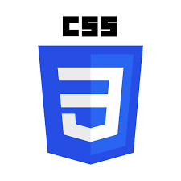
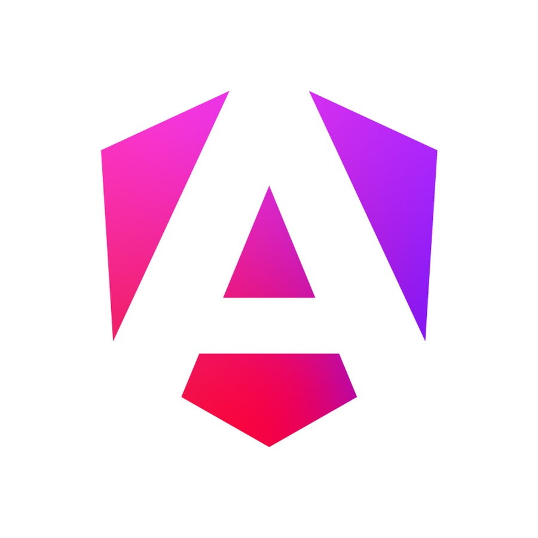

  <h1>Hi, I'm Connie Knupp </h1>
  
<strong>Software Engineer | Bridging Healthcare Workflows with Scalable Code</strong>

  

    
    
    

---

### 💫 About Me
I am a **Software Engineering student (4.0 GPA)** at SNHU with 15+ years of experience in healthcare technology. I specialize in **Systems Administration (PACS)** and database troubleshooting, now transitioning into building robust digital infrastructure.

- 🎓 **Education:** B.S. in Computer Science (Software Engineering)
- 📍 **Location:** Tucson, AZ
- ⚡ **Fun Fact:** I’ve spent over a decade optimizing cardiac CT protocols and managing hospital-wide imaging systems!

---

### 🛠️ Tech Stack & Skills

<table>
  <tr>
    <th width="200">Category</th>
    <th>Tools & Languages</th>
  </tr>
  <tr>
    <td><b>Languages</b></td>
    <td>
      
      
      
      
    </td>
  </tr>
  <tr>
    <td><b>Frameworks</b></td>
    <td>
      
      
      
      
    </td>
  </tr>
  <tr>
    <td><b>Databases</b></td>
    <td>
      
      
    </td>
  </tr>
  <tr>
    <td><b>Cloud/DevOps</b></td>
    <td>
      
      
      
    </td>
  </tr>
</table>
---

### 🏥 Healthcare IT Expertise
With a background as a **Senior System Administrator**, I bring deep technical knowledge in:
- **Systems:** Merge PACS, Fuji Synapse, Powerscribe 360, Nuance Powershare.
- **Problem Solving:** Resolving complex database errors and image routing failures in high-pressure hospital environments.
- **Optimization:** Designed CT acquisition protocols to maximize data resolution and clinical efficiency.

### 🤝 Let's Connect!
I’m currently looking for **Software Engineering internships or entry-level roles**, particularly those that value a background in healthcare or systems administration.

- 📞 **Phone:** 520-909-4433
- 📧 **Email:** [c20knupp@gmail.com](mailto:c20knupp@gmail.com)
